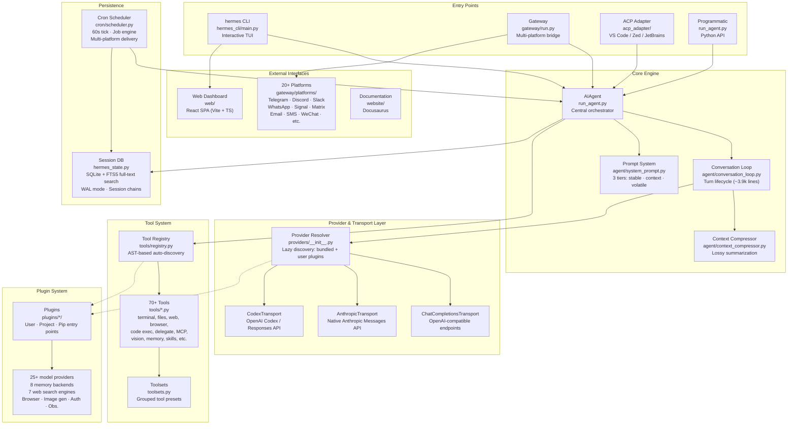
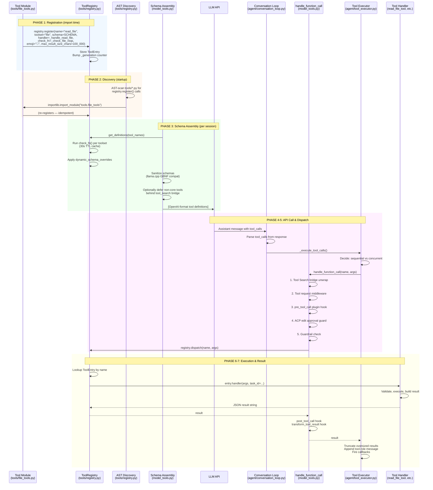

# Hermes Agent — Architecture

> **Hermes Agent** is an open-source, self-improving AI agent by **Nous Research** (v0.16.0, MIT).  
> It creates skills from experience, improves them during use, and runs anywhere — terminal, messaging platforms, IDE, or programmatically.  
> Supports 200+ models and ships with 70+ built-in tools.

---

## Architecture Diagram



---

## Key Architectural Layers

### 1. Entry Points (4 ways to run)

| Entry | File | Use Case |
|---|---|---|
| `hermes` | `hermes_cli/main.py` | Interactive terminal TUI |
| Gateway | `gateway/run.py` | Multi-platform messaging bot |
| `hermes-acp` | `acp_adapter/entry.py` | IDE integration (ACP protocol) |
| `hermes-agent` | `run_agent.py` | Programmatic / script usage |

### 2. Core Engine — `AIAgent` class

The central orchestrator in [run_agent.py](run_agent.py). Its conversation loop ([agent/conversation_loop.py](agent/conversation_loop.py), ~3,900 lines) drives the turn lifecycle:

1. **Build system prompt** — 3 tiers: *stable* (identity, tool guidance, skills), *context* (caller-supplied messages, AGENTS.md), *volatile* (memory snapshot, user profile, timestamp)
2. **Resolve provider** — selects API mode (`chat_completions`, `anthropic_messages`, or `codex_responses`) and credentials
3. **Call model** — interruptible, with retry and fallback model switching
4. **Execute tools** — sequential or concurrent (`ThreadPoolExecutor`), then loop back
5. **Persist** — flush to SQLite session DB, compress if >50% context used

### 3. Provider & Transport Layer

Declarative `ProviderProfile` dataclasses ([providers/base.py](providers/base.py)) describe each inference provider. Three transport implementations normalize API differences into a shared `NormalizedResponse` type:

| Transport | File | API Mode | Used For |
|---|---|---|---|
| `ChatCompletionsTransport` | `agent/transports/chat_completions.py` | `chat_completions` | OpenAI-compatible (OpenRouter, 16+ providers) |
| `AnthropicTransport` | `agent/transports/anthropic.py` | `anthropic_messages` | Native Anthropic Messages API + prompt caching |
| `CodexTransport` | `agent/transports/codex.py` | `codex_responses` | OpenAI Codex / Responses API |

25+ bundled providers in [plugins/model-providers/](plugins/model-providers/); user plugins override bundled ones on name collision.

### 4. Tool System

[model_tools.py](model_tools.py) orchestrates tool discovery, schema collection, and dispatch. [tools/registry.py](tools/registry.py) uses **AST scanning** to auto-discover tools — no manual import list needed. 70+ tools across 28 toolsets, including:

| Category | Key Tools |
|---|---|
| Terminal | `terminal`, `process` (6 backends: local, Docker, SSH, Singularity, Modal, Daytona) |
| Files | `read_file`, `write_file`, `patch`, `search_files` |
| Web | `web_search`, `web_extract`, `browser_navigate`, `browser_snapshot`, `browser_click` |
| Code | `execute_code` (sandboxed) |
| Agent | `delegate_task` (isolated subagent spawning) |
| Integration | MCP client, `vision_analyze`, `image_generate` |
| Memory | `memory` (persistent), `session_search` (FTS5 full-text) |
| Skills | `skills_list`, `skill_view`, `skill_manage` |
| Desktop | `computer_use` (macOS desktop control) |

### 5. Plugin System

Three discovery sources: user (`~/.hermes/plugins/`), project (`.hermes/plugins/`), and pip entry points. Plugin categories:

| Category | Path | Examples |
|---|---|---|
| Model providers | `plugins/model-providers/` | anthropic, openai, gemini, deepseek, nous, openrouter, xai (25+) |
| Memory | `plugins/memory/` | honcho, mem0, holographic, supermemory, retaindb, byterover (8) |
| Web search | `plugins/web/` | firecrawl, exa, tavily, ddgs, brave_free, searxng, parallel (7) |
| Browser | `plugins/browser/` | browser_use, browserbase, firecrawl |
| Image generation | `plugins/image_gen/` | fal, krea, openai, xai |
| Video generation | `plugins/video_gen/` | fal, xai |
| Dashboard auth | `plugins/dashboard_auth/` | basic, nous, self_hosted |
| Observability | `plugins/observability/` | langfuse, nemo_relay |
| Context engine | `plugins/context_engine/` | Pluggable context management |
| Other | | spotify, google_meet, kanban, achievements, security-guidance |

### 6. Gateway & Multi-Platform Messaging

A long-running process ([gateway/run.py](gateway/run.py)) managing 20+ platform adapters:

- **Session management** — per-user/per-chat agent instances with full conversation persistence
- **DM pairing** — authorization flow for private chats
- **Cron integration** — scheduled jobs delivered to any platform
- **Message mirroring** — cross-session forwarding
- **Hook system** — lifecycle events for custom behavior

Platform adapters in [gateway/platforms/](gateway/platforms/):

| Built-in | Plugin-based |
|---|---|
| telegram, discord, slack, whatsapp, signal, matrix | google_chat, irc, line, ntfy, photon, simplex, teams |
| mattermost, email, sms, dingtalk, feishu, wecom | |
| weixin, bluebubbles, qqbot, homeassistant, webhook | |
| api_server, yuanbao | |

### 7. Persistence

- **Session DB** ([hermes_state.py](hermes_state.py)) — SQLite with WAL mode for concurrent readers + writer, FTS5 virtual table for full-text search across messages, compression-triggered session splitting via `parent_session_id` chains, session source tagging (`cli`, `telegram`, `discord`, etc.)
- **Cron Scheduler** ([cron/scheduler.py](cron/scheduler.py)) — 60-second `tick()` loop invoked by gateway, jobs stored as JSON with multiple schedule formats, first-class agent tasks (not shell tasks), can attach skills and deliver to any platform

### 8. ACP Adapter (IDE Integration)

Exposes Hermes as an editor-native agent over stdio/JSON-RPC for VS Code, Zed, and JetBrains ([acp_adapter/](acp_adapter/)):

| File | Purpose |
|---|---|
| `acp_adapter/entry.py` | Entry point (`hermes-acp` command) |
| `acp_adapter/server.py` | ACP server implementation |
| `acp_adapter/session.py` | Session management |
| `acp_adapter/tools.py` | Tool adaptation for ACP protocol |
| `acp_adapter/auth.py` | Authentication |
| `acp_adapter/permissions.py` | Permission management |

---

## Data Flow

### CLI Session

```
User Input → hermes_cli/main.py
  → HermesCLI.process_input()
    → AIAgent.run_conversation()
      → prompt_builder.build_system_prompt() (3 tiers)
      → Provider resolution → Transport → API call
      → Tool calls? → model_tools.handle_function_call() → loop
      → Final response → display → save to SessionDB (SQLite)
```

### Gateway Message

```
Platform Event → Adapter.on_message() → MessageEvent
  → GatewayRunner._handle_message()
    → Authorize (allowlist + DM pairing)
    → Resolve session key
    → Create/get cached AIAgent with session history
    → AIAgent.run_conversation()
    → Deliver response through adapter
```

### Cron Job

```
Scheduler tick (every 60s) → load due jobs from jobs.json
  → Create fresh AIAgent (no history)
  → Inject attached skills as context
  → Run job prompt (with protected toolset restrictions)
  → Deliver response to target platform
  → Update job state and next_run
```

### Provider Resolution Order

1. Explicit `api_mode` constructor arg (highest priority)
2. Provider-specific detection (e.g., `anthropic` provider → `anthropic_messages`)
3. Base URL heuristics (e.g., `api.anthropic.com` → `anthropic_messages`)
4. Default: `chat_completions`

### Tool Registration Chain

```
tools/registry.py  (no deps — imported by all tool files)
       ↑
tools/*.py  (each calls registry.register() at import time)
       ↑
model_tools.py  (imports tools/registry + triggers tool discovery)
       ↑
run_agent.py, cli.py, batch_runner.py, etc.
```

---

## Project Structure

```
hermes-agent/
├── run_agent.py              # AIAgent class (~3,600 lines)
├── cli.py                    # HermesCLI interactive terminal UI
├── model_tools.py            # Tool discovery, schema collection, dispatch
├── toolsets.py               # Tool groupings and platform presets
├── hermes_state.py           # SQLite session/state database with FTS5
├── hermes_constants.py       # HERMES_HOME, profile-aware paths
├── hermes_bootstrap.py       # Windows UTF-8 stdio bootstrap
├── hermes_logging.py         # Logging configuration
├── hermes_time.py            # Time utilities
├── batch_runner.py           # Batch trajectory generation
├── trajectory_compressor.py  # Trajectory compression for training
├── toolset_distributions.py  # Tool distribution analysis
├── utils.py                  # Shared utility functions
├── mcp_serve.py              # MCP server mode
├── mini_swe_runner.py        # Mini SWE-bench runner
│
├── agent/                    # Agent internals (40+ files)
│   ├── system_prompt.py      # Prompt assembly (3 tiers)
│   ├── conversation_loop.py  # Turn lifecycle (~3,900 lines)
│   ├── prompt_builder.py     # Stateless prompt fragment builders
│   ├── prompt_caching.py     # Anthropic cache breakpoint markers
│   ├── context_compressor.py # Lossy summarization
│   ├── agent_init.py         # AIAgent.__init__ (~1,400 lines)
│   └── transports/           # Provider transport implementations
│       ├── base.py           # ProviderTransport ABC
│       ├── chat_completions.py
│       ├── anthropic.py
│       └── codex.py
│
├── hermes_cli/               # CLI subcommands (120+ files)
│   └── main.py               # Main CLI entry point
│
├── gateway/                  # Messaging platform gateway (20+ files)
│   ├── run.py                # GatewayRunner
│   ├── session.py            # SessionStore
│   ├── delivery.py           # Outbound message routing
│   ├── pairing.py            # DM pairing authorization
│   ├── hooks.py              # Hook discovery
│   ├── mirror.py             # Cross-session mirroring
│   └── platforms/            # 20 platform adapters
│
├── tools/                    # Tool implementations (70+ tools)
│   └── registry.py           # Central ToolEntry registry (AST-based discovery)
│
├── cron/                     # Scheduled job scheduler
│   ├── scheduler.py          # tick() called every 60s
│   └── jobs.py               # Job model and storage
│
├── providers/                # Provider profile registry
│   ├── base.py               # ProviderProfile dataclass
│   └── __init__.py           # Lazy discovery
│
├── plugins/                  # Plugin system
│   ├── model-providers/      # 25+ bundled providers
│   ├── memory/               # 8 memory backends
│   ├── web/                  # 7 search engines
│   ├── browser/              # Browser automation
│   ├── image_gen/            # Image generation
│   ├── video_gen/            # Video generation
│   ├── dashboard_auth/       # Auth providers
│   ├── observability/        # Telemetry
│   └── platforms/            # Additional platform adapters
│
├── skills/                   # Bundled skills (always available)
├── optional-skills/          # Official optional skills
├── acp_adapter/              # ACP server for editor integration
├── tui_gateway/              # WebSocket-based terminal UI bridge
├── apps/                     # Desktop apps (Tauri-based bootstrap installer)
├── web/                      # React dashboard SPA (Vite + TypeScript)
├── website/                  # Docusaurus documentation site
├── tests/                    # Pytest suite (~1,250 test files)
├── scripts/                  # Developer and CI scripts
├── docker/                   # Docker build files
├── docs/                     # In-repo documentation
├── locales/                  # i18n YAML catalogs
├── optional-mcps/            # Shipped MCP server manifests
├── nix/                      # Nix flake utilities
├── packaging/                # Packaging resources
└── assets/                   # Images, banners
```

---

## Key Configuration

- **Primary config**: `hermes config set` / YAML config in `~/.hermes/`
- **Environment vars**: See `.env.example` for complete reference
- **`HERMES_HOME`**: Defaults to `~/.hermes` (or `%LOCALAPPDATA%\hermes` on Windows), overridable via env var
- **Core dependencies**: openai, pydantic, httpx, rich, pyyaml, jinja2, prompt_toolkit, croniter, fastapi, uvicorn, Pillow — all exact-pinned

---

## Tool System Architecture & Lifecycle

### Overview

The Hermes tool system is a **self-registering, schema-driven, AST-discovered** plugin architecture. 70+ tools across 28 toolsets are discovered automatically at import time — no manual import list exists. Every tool goes through a well-defined lifecycle: **Register → Discover → Schema Assembly → API Call → Dispatch → Execute → Result**.

### Lifecycle Diagram



### End-to-End Data Flow

```
                   ┌──────────────────────────────────────────┐
                   │         REGISTRATION (import time)        │
                   │  tools/*.py → registry.register()        │
                   │  Stores: name, toolset, schema, handler,  │
                   │          check_fn, emoji, max_chars       │
                   └──────────────────┬───────────────────────┘
                                      │
                   ┌──────────────────▼───────────────────────┐
                   │         DISCOVERY (startup)               │
                   │  AST-scan tools/*.py for register() calls │
                   │  importlib.import_module() each match     │
                   └──────────────────┬───────────────────────┘
                                      │
                   ┌──────────────────▼───────────────────────┐
                   │     SCHEMA ASSEMBLY (per agent session)   │
                   │  Resolve toolsets → filter by check_fn   │
                   │  → dynamic overrides → sanitize          │
                   │  → optionally defer via tool_search       │
                   └──────────────────┬───────────────────────┘
                                      │
                   ┌──────────────────▼───────────────────────┐
                   │         API CALL → MODEL DECIDES          │
                   │  Model receives schemas + prompt         │
                   │  Returns assistant msg with tool_calls   │
                   └──────────────────┬───────────────────────┘
                                      │
                   ┌──────────────────▼───────────────────────┐
                   │             DISPATCH PIPELINE             │
                   │  Coerce → Bridge → Middleware → Hook     │
                   │  → ACP approval → Guardrail → Execute    │
                   │  → post_tool_call → transform_result     │
                   └──────────────────┬───────────────────────┘
                                      │
                   ┌──────────────────▼───────────────────────┐
                   │         registry.dispatch(name, args)     │
                   │  Lookup entry → call handler(args, **kw) │
                   │  Sync or async-bridged → catch exceptions │
                   └──────────────────┬───────────────────────┘
                                      │
                   ┌──────────────────▼───────────────────────┐
                   │              RESULT HANDLING              │
                   │  Truncate → sanitize → wrap as tool msg  │
                   │  → append to messages → fire callbacks   │
                   │  → LOOP BACK for next model call         │
                   └──────────────────────────────────────────┘
```

---

### Phase 1: Registration

At the bottom of every tool file, tools call `registry.register()` at **module level**. This runs once when the module is first imported.

#### `ToolEntry` dataclass (stored in registry)

| Field | Purpose |
|---|---|
| `name` | Unique tool identifier (`"read_file"`, `"terminal"`) |
| `toolset` | Logical group (`"file"`, `"terminal"`, `"web"`) |
| `schema` | OpenAI-format JSON schema with `name`, `description`, `parameters` |
| `handler` | Callable `(args: dict, **kwargs) -> str` that returns a JSON string |
| `check_fn` | Availability gate — returns `True` if the toolset's dependencies are met |
| `requires_env` | List of env vars this tool needs |
| `is_async` | If `True`, handler is wrapped with `_run_async()` |
| `emoji` | UI icon (`"📖"`, `"✍️"`, `"🔧"`) |
| `max_result_size_chars` | Result truncation limit (e.g., 100,000 for file tools) |
| `dynamic_schema_overrides` | Callable returning schema patches based on runtime config |

#### Example: [tools/file_tools.py:1668-1671](tools/file_tools.py#L1668)

```python
registry.register(name="read_file", toolset="file",
    schema=READ_FILE_SCHEMA, handler=_handle_read_file,
    check_fn=_check_file_reqs, emoji="📖", max_result_size_chars=100_000)
registry.register(name="write_file", toolset="file",
    schema=WRITE_FILE_SCHEMA, handler=_handle_write_file,
    check_fn=_check_file_reqs, emoji="✍️", max_result_size_chars=100_000)
registry.register(name="patch", toolset="file",
    schema=PATCH_SCHEMA, handler=_handle_patch,
    check_fn=_check_file_reqs, emoji="🔧", max_result_size_chars=100_000)
registry.register(name="search_files", toolset="file",
    schema=SEARCH_FILES_SCHEMA, handler=_handle_search_files,
    check_fn=_check_file_reqs, emoji="🔎", max_result_size_chars=100_000)
```

#### Registration safety

The registry uses a **reentrant lock** (`threading.RLock`) and a **monotonically-increasing generation counter**. It prevents accidental shadowing — if tool "X" from toolset "A" tries to overwrite tool "X" from toolset "B", the registration is **rejected** unless `override=True` is explicitly passed (plugin opt-in). MCP-to-MCP overwrites are allowed (server refresh). Every mutation bumps `_generation`, which invalidates the schema definition cache.

---

### Phase 2: Discovery

`discover_builtin_tools()` in [tools/registry.py:57](tools/registry.py#L57) finds all tool files using **AST scanning**:

1. `glob("tools/*.py")` finds all Python files in the tools directory
2. Each file is parsed with `ast.parse()` — **not executed**
3. `_is_registry_register_call()` walks the AST looking for `registry.register(...)` call expressions
4. Only files containing registration calls are imported via `importlib.import_module()`
5. The act of importing triggers module-level `registry.register()` calls

This means **no manual import list exists** — adding a new tool file with `registry.register()` calls is enough for it to be discovered.

```python
def _is_registry_register_call(node: ast.AST) -> bool:
    """Return True when node is a registry.register(...) call expression."""
    if not isinstance(node, ast.Expr) or not isinstance(node.value, ast.Call):
        return False
    func = node.value.func
    return (
        isinstance(func, ast.Attribute)
        and func.attr == "register"
        and isinstance(func.value, ast.Name)
        and func.value.id == "registry"
    )
```

---

### Phase 3: Schema Assembly

`get_tool_definitions()` in [model_tools.py:272](model_tools.py#L272) runs **per agent session** and produces the final list of OpenAI-format tool definitions sent to the model.

#### Step-by-step pipeline

```
Step 1: Resolve enabled toolsets
  ├─ Fast path: memoized result (cache key: toolsets × registry generation × config mtime)
  └─ Slow path: _compute_tool_definitions()

Step 2: Expand toolsets → tool names
  ├─ validate_toolset() + resolve_toolset() for each enabled toolset
  ├─ Apply disabled toolsets as subtraction
  └─ Plugins resolved through normal toolset path

Step 3: Filter by availability (check_fn)
  └─ registry.get_definitions(tool_names)
       ├─ For each tool: run check_fn() if present
       ├─ check_fn results cached with 30s TTL (_check_fn_cached)
       └─ Unavailable tools silently dropped

Step 4: Dynamic schema overrides
  ├─ execute_code: rebuild schema to list only available sandbox tools
  ├─ discord/discord_admin: rebuild based on bot intents + action allowlist
  └─ browser_navigate: strip cross-references to unavailable web tools

Step 5: Schema sanitization
  └─ sanitize_tool_schemas() — fix shapes rejected by llama.cpp GBNF parser
       (bare "type":"object" with no properties, string-valued schema nodes)

Step 6: Tool Search bridge (progressive disclosure)
  └─ If deferrable surface > threshold (default 10% of context window):
       Replace MCP + plugin (non-core) tools with 3 bridge tools:
         tool_search  — search the deferred catalog
         tool_describe — get full schema for one deferred tool
         tool_call    — invoke a deferred tool by name
       Core Hermes tools are NEVER deferred.
```

#### `check_fn` — the availability gate

Each toolset has a `check_fn` that gates whether its tools appear in the schema. For example, the `file` toolset's check verifies basic filesystem access. The `browser` toolset's check probes Playwright. The `terminal` toolset's check probes the configured backend (Docker/SSH/Modal/etc.). Results are cached for 30 seconds so repeated probes don't slow down startup.

The check runs inside `registry.get_definitions()`:
```python
if entry.check_fn:
    if entry.check_fn not in check_results:
        check_results[entry.check_fn] = _check_fn_cached(entry.check_fn)
    if not check_results[entry.check_fn]:
        continue  # tool skipped
```

---

### Phase 4: API Call — Model Decides to Use Tools

The assembled tool definitions are sent to the model alongside the system prompt and conversation history. When the model decides to call tools, it returns an assistant message with a `tool_calls` array. The conversation loop ([agent/conversation_loop.py:436](agent/conversation_loop.py#L436)) parses this and routes to execution:

```python
# In run_conversation():
if assistant_message.tool_calls:
    agent._execute_tool_calls(assistant_message, messages, effective_task_id, api_call_count)
    continue  # loop back for next API call
```

---

### Phase 5: Dispatch — `handle_function_call()`

The central dispatch function in [model_tools.py:876](model_tools.py#L876) is the **gateway for every tool execution**. It runs a 10-step layered pipeline:

```
1. Coerce arguments
   └─ coerce_tool_args() — e.g., "42" → 42 based on schema types

2. Tool Search bridge unwrap
   ├─ tool_search → dispatch_tool_search() — catalog query
   ├─ tool_describe → dispatch_tool_describe() — schema lookup
   └─ tool_call → resolve_underlying_call() → recurse with real tool name
        (scope-gated: must be in session's deferrable catalog)

3. Tool request middleware
   └─ apply_tool_request_middleware() — plugins transform args
      (e.g., nemo_relay routes through content-safety scanner)

4. pre_tool_call plugin hook (single-fire contract)
   └─ get_pre_tool_call_block_message()
      ├─ Observer plugins see the hook here
      └─ Returns block directive → execution stops, error returned

5. ACP edit approval (IDE integration)
   └─ maybe_require_edit_approval()
      Pauses for user approval in VS Code / Zed / JetBrains
      (only active for ACP sessions; no-op in CLI/gateway)

6. Guardrail evaluation
   └─ agent._tool_guardrails.before_call()

7. Execution middleware chain
   └─ run_tool_execution_middleware() wraps registry.dispatch()
      (e.g., nemo_relay adaptive_llm: scans result for harmful content)

8. registry.dispatch(name, args) — actual execution

9. post_tool_call plugin hook (observational only)
   └─ _emit_post_tool_call_hook() — latency, status, error details

10. transform_tool_result plugin hook
    └─ Plugins may replace the result string (first valid string return wins)
```

#### Scope enforcement for bridge tools

When bridge `tool_call` is used, two layers of scope enforcement prevent restricted sessions from invoking out-of-scope tools:
- `resolve_underlying_call()` checks the tool is deferrable in the global registry
- An additional gate checks the tool is in the session's scoped deferrable catalog

---

### Phase 6: Execution — `registry.dispatch()`

[registry.py:390](tools/registry.py#L390) is the final hop before the handler runs:

```python
def dispatch(self, name: str, args: dict, **kwargs) -> str:
    entry = self.get_entry(name)
    if not entry:
        return json.dumps({"error": f"Unknown tool: {name}"})
    try:
        if entry.is_async:
            from model_tools import _run_async
            return _run_async(entry.handler(args, **kwargs))
        return entry.handler(args, **kwargs)
    except Exception as e:
        raw = f"Tool execution failed: {type(e).__name__}: {e}"
        sanitized = _sanitize_tool_error(raw)
        return json.dumps({"error": sanitized})
```

Key details:

- **Sync/async bridging**: `is_async=True` tools get wrapped with `_run_async()` for automatic event-loop management
- **Exception safety**: All exceptions are caught and returned as `{"error": "..."}` — a tool crash never kills the agent
- **Error sanitization**: Error messages are scrubbed of Markdown fences, CDATA, and other tokens that could confuse the model

#### Concurrent execution

When a batch of tool calls looks independent, they run in parallel via `ThreadPoolExecutor` ([agent/tool_executor.py:243](agent/tool_executor.py#L243)):

1. **Pre-flight interrupt check** — if interrupted, all tools get cancellation stubs
2. **Parse & pre-execute** — arguments parsed, middleware applied, guardrails evaluated; **block evaluation happens BEFORE checkpoint preflight**
3. **Checkpoint preflight** — file-mutating tools (`write_file`, `patch`) and destructive terminal commands create git checkpoints before execution
4. **Concurrent fan-out** — each tool runs in its own thread with:
   - Thread-local activity callback (heartbeats during long ops)
   - ContextVar propagation (approval/sudo callbacks, turn metadata)
   - Interrupt registration (agent can signal worker threads)
5. **Result collection** — results gathered in original tool-call order and appended to messages

The serial vs. concurrent decision is made by `_should_parallelize_tool_batch()`:
- Read-only tools always parallelize
- File reads/writes parallelize only when paths don't overlap
- Terminal commands always serialize

---

### Phase 7: Result Handling

#### Inside each tool handler

Every tool handler (e.g., `read_file_tool` in [tools/file_tools.py:784](tools/file_tools.py#L784)) is responsible for its own validation, execution, and result formatting. Common patterns:

| Pattern | Example |
|---|---|
| **Input validation** | `write_file` checks `path` and `content` are present, right types |
| **Security guards** | Device path blocking, binary extension blocking, HERMES_HOME credential path blocking |
| **Anti-loop protection** | `read_file` tracks consecutive reads of the same region — warns at 3, hard-blocks at 4 |
| **Dedup** | `read_file` returns a stub if the file hasn't changed since last read |
| **Result size limit** | Content > max chars → rejected with guidance to narrow the read |
| **Secret redaction** | `redact_sensitive_text()` strips API keys, tokens before results reach the model |
| **Helper functions** | `tool_error("msg")` → `{"error": "msg"}`, `tool_result({"key": val})` → `{"key": val}` |

#### After dispatch returns

Back in the executor/conversation loop:

1. **Truncation** — results exceeding per-tool or global limits are truncated with a note
2. **Tool-role message** — result is wrapped in `{"role": "tool", "tool_call_id": "...", "content": result}` and appended to the message list
3. **Callbacks** — `tool_progress_callback`, `tool_finished_callback` fire for UI updates
4. **Post-execution drain** — if a `/steer` arrived during execution, it's appended to the tool result content
5. **Loop continuation** — the agent loops back for another API call with the new tool results in context

---

### Key Files

| File | Role |
|---|---|
| [tools/registry.py](tools/registry.py) | `ToolRegistry` singleton, `ToolEntry` dataclass, registration, AST discovery, dispatch |
| [model_tools.py](model_tools.py) | `get_tool_definitions()`, `handle_function_call()`, schema assembly, middleware orchestration |
| [toolsets.py](toolsets.py) | Toolset groupings (`_HERMES_CORE_TOOLS`, resolve/validate toolsets) |
| [tools/*.py](tools/) | 70+ self-registering tool modules |
| [agent/tool_executor.py](agent/tool_executor.py) | Concurrent execution, guardrail evaluation, result collection |
| [agent/conversation_loop.py](agent/conversation_loop.py) | Main loop: receives model response, routes tool calls, loops back |
| [agent/agent_runtime_helpers.py](agent/agent_runtime_helpers.py) | `_invoke_tool()`, message repair, tool call sanitization |
| [tools/tool_search.py](tools/tool_search.py) | Progressive disclosure bridge: defers non-core tools behind search/describe/call |
| [tools/schema_sanitizer.py](tools/schema_sanitizer.py) | Backend-compatible schema normalization |
| [hermes_cli/middleware.py](hermes_cli/middleware.py) | Tool request/execution middleware chain |

---

## Further Reading

The canonical architecture documentation is at [website/docs/developer-guide/architecture.md](website/docs/developer-guide/architecture.md). Detailed subsystem docs:

- [Agent loop internals](website/docs/developer-guide/agent-loop.md)
- [Prompt assembly](website/docs/developer-guide/prompt-assembly.md)
- [Provider runtime](website/docs/developer-guide/provider-runtime.md)
- [Gateway internals](website/docs/developer-guide/gateway-internals.md)
- [Session storage](website/docs/developer-guide/session-storage.md)
- [Cron internals](website/docs/developer-guide/cron-internals.md)
- [ACP internals](website/docs/developer-guide/acp-internals.md)
- [Tools runtime](website/docs/developer-guide/tools-runtime.md)
- [Context compression & caching](website/docs/developer-guide/context-compression-and-caching.md)
