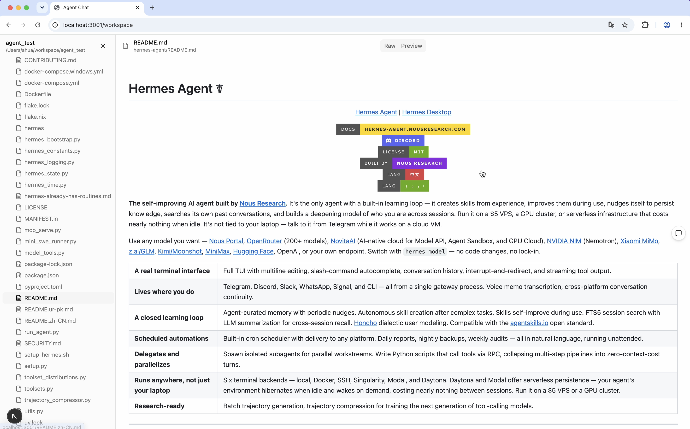
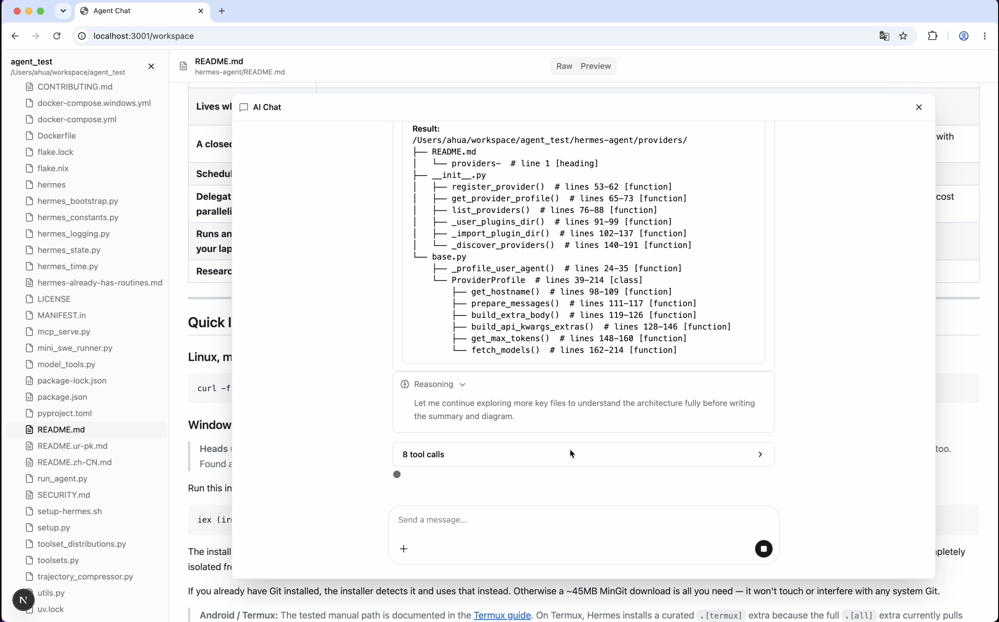
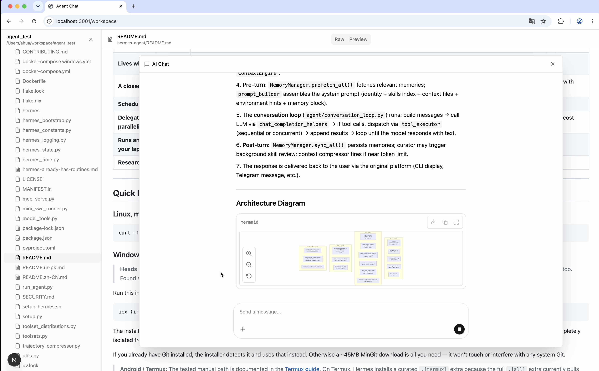

# Simple Agent

A task-driven AI coding agent with an orchestrator/task-agent lifecycle, durable
repository memory, and a web UI.

## Demo







<video src="https://raw.githubusercontent.com/AHua-haha/simple-agent/main/assets/demo.mp4" controls width="800"></video>

## Structure

```
├── backend/      # Python agent (task manager, session runner, web API)
├── frontend/     # Next.js web UI
```

## Backend

### Architecture

```
User Input
    │
    ▼
┌─────────────────────────────────────────────────┐
│                SessionRunner                     │
│  phase-driven loop: orchestrator ⇄ common_task  │
└─────────────────────────────────────────────────┘
    │                    │
    ▼                    ▼
┌──────────────┐  ┌──────────────────┐
│ Orchestrator  │  │  CommonTask      │
│ Lifecycle     │  │  Lifecycle       │
│              │  │                  │
│ • task_plan   │  │ • instruction    │
│ • instruction │  │ • response       │
│ • finish_task │  │ • coding tools   │
│              │  │ • index_tree      │
└──────────────┘  └──────────────────┘
```

### Orchestrator / Task-Agent Workflow

The agent uses a ping-pong lifecycle between two phases:

**Orchestrator Phase** — inspects task state and decides next steps. Tools:

| Tool | Purpose |
|---|---|
| `set_instruction` | Assign one atomic task to the agent |
| `update_task_plan` | Maintain a markdown task list (`- [x]` done, `- [ ]` pending) |
| `finish_task` | Mark the entire task as complete |

Each instruction must contain exactly **one atomic task**. The orchestrator
decomposes complex work into single steps.

**Common Task Phase** — executes the instruction with coding tools (`read`,
`write`, `edit`, `bash`, `grep`, `find`, `ls`), `index_tree` for repository
exploration, and `response_instruction` to report completion or errors. The
agent never works outside the scope of the current instruction.

**Routing:** `"orchestrator"` → `"common_task"` → `"orchestrator"` → … → `"done"`.

### Index Memory System

A durable, repository-scoped memory store (SQLite `.index.db`) with concise
descriptions of files, modules, classes, and markdown sections.

- **`index_tree`** — renders a filtered tree view with directory structure,
  Python symbols (AST), markdown headings, and existing descriptions
- **`index_upsert`** — creates or updates a memory entry for a path
- **Auto-commit** — expires stale entries when the repo changes (via git diff)

### Repo Watcher

Tracks file changes between git commits. Detects renames via
`git diff --name-status` and feeds the index system so it knows which memory
entries need review after code changes.

### Session Persistence

Sessions stored as SQLite databases (`backend/sessions/`), with JSONL runtime
logs (`backend/logs/session_runs/`).

### Setup

```bash
cd backend
uv sync
cp .env.example .env  # add your API keys
python -m simple_agent.web.app --port 8080
```

## Frontend

Next.js 15 web UI with assistant-ui chat components.

```bash
cd frontend
npm install
npm run dev
```
